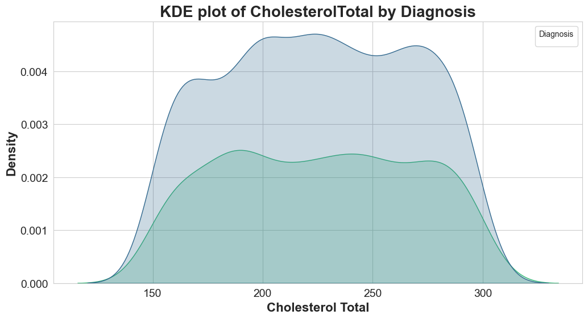

# Data Visualization 📊

This folder contains the Jupyter Notebook and documentation related to the data visualization process. The visualizations help in understanding the distribution and relationships of various variables in the dataset, particularly in relation to the diagnosis of Alzheimer's disease.

## Visualizations Included

### 1. Countplot for Diagnosis 📈
- **Description**: A countplot showing the distribution of diagnoses (positive and negative) in the dataset.
- **Purpose**: To understand the overall distribution of Alzheimer's diagnoses.
- 

### 2. Countplot of Diagnoses by Age Range 👵👴
- **Description**: A countplot showing the distribution of diagnoses across different age ranges.
- **Purpose**: To analyze how age affects the likelihood of an Alzheimer's diagnosis.
- 

### 3. Bar Plot of BMI by Diagnosis ⚖️
- **Description**: A bar plot showing the average BMI for positive and negative diagnoses.
- **Purpose**: To investigate the relationship between BMI and Alzheimer's diagnosis.
- 

### 4. Bar Plot of Gender by Diagnosis 🚻
- **Description**: A bar plot showing the distribution of diagnoses by gender.
- **Purpose**: To explore any gender differences in Alzheimer's diagnosis rates.
- 

### 5. Pie Chart for the Distribution of Alcohol Consumption in Positive Diagnoses 🍷
- **Description**: A pie chart showing the distribution of alcohol consumption levels among patients with a positive diagnosis.
- **Purpose**: To understand the prevalence of alcohol consumption in patients diagnosed with Alzheimer's.
- 

### 6. Bar Plot of Ethnicity by Diagnosis 🌍
- **Description**: A bar plot showing the distribution of diagnoses across different ethnic groups.
- **Purpose**: To examine any ethnic disparities in Alzheimer's diagnosis rates.
- 

### 7. Bar Plot of Physical Activity by Diagnosis 🏃‍♂️
- **Description**: A bar plot showing the average levels of physical activity for positive and negative diagnoses.
- **Purpose**: To analyze the impact of physical activity on Alzheimer's diagnosis.
- 

### 8. Bar Plot of Diet Quality by Diagnosis 🥗
- **Description**: A bar plot showing the average diet quality scores for positive and negative diagnoses.
- **Purpose**: To investigate the relationship between diet quality and Alzheimer's diagnosis.
- 

### 9. Countplot of Family History of Alzheimer's by Diagnosis 👨‍👩‍👧‍👦
- **Description**: A countplot showing the distribution of family history of Alzheimer's across diagnoses.
- **Purpose**: To explore the influence of family history on Alzheimer's diagnosis.
- 

### 10. Bar Plot of Memory Complaints by Diagnosis 🧠
- **Description**: A bar plot showing the average number of memory complaints for positive and negative diagnoses.
- **Purpose**: To understand the relationship between memory complaints and Alzheimer's diagnosis.
- 

### 11. Countplot of Behavioral Problems by Diagnosis 🧩
- **Description**: A countplot showing the distribution of behavioral problems across diagnoses.
- **Purpose**: To analyze the prevalence of behavioral problems in Alzheimer's patients.
- 

### 12. Histogram of Age 📅
- **Description**: A histogram showing the distribution of ages in the dataset.
- **Purpose**: To visualize the age distribution of the study population.
- 

### 13. Histogram of Alcohol Consumption 🍺
- **Description**: A histogram showing the distribution of alcohol consumption levels in the dataset.
- **Purpose**: To understand the overall alcohol consumption patterns in the study population.
- 

### 14. KDE Plot of Cholesterol Total by Diagnosis 🩸
- **Description**: A KDE plot showing the distribution of total cholesterol levels for positive and negative diagnoses.
- **Purpose**: To compare cholesterol levels between diagnosed and non-diagnosed patients.
- 

### 15. KDE Plot of MMSE by Diagnosis 🧠
- **Description**: A KDE plot showing the distribution of MMSE scores for positive and negative diagnoses.
- **Purpose**: To analyze the cognitive function differences between diagnosed and non-diagnosed patients.
- 

### 16. Histogram of Age by Diagnosis 📅
- **Description**: A histogram showing the age distribution for positive and negative diagnoses.
- **Purpose**: To visualize how age varies between diagnosed and non-diagnosed patients.
- 

## Files Included

- **data_visualization.ipynb**: Jupyter Notebook containing all the visualizations listed above.

## How to Use

1. **Open `data_visualization.ipynb`**: This Jupyter Notebook contains all the visualizations.
2. **Run the Notebook**: Execute each cell in the notebook to generate the visualizations.
3. **Review the Visualizations**: Each visualization includes a description and purpose to help you understand the insights it provides.

## Summary

The visualizations in this folder provide a comprehensive overview of the dataset, highlighting key patterns and relationships between variables and Alzheimer's diagnosis. These visualizations are crucial for understanding the data and guiding further analysis and modeling efforts.

---

Feel free to reach out if you have any questions or need further assistance with the data visualization process.